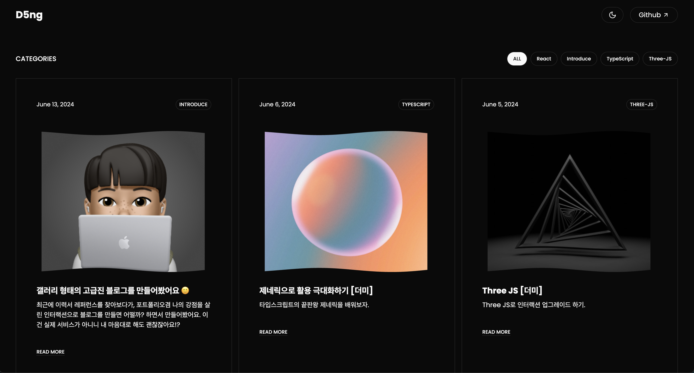

### 기술 스택

  

  

    

  

  

  

  

### 소개

[블로그 구경하러가기](https://d5ng-blog.vercel.app/)

2021-2023 유행을 많이했었던 **Grid Layout 디자인을 참고해 고급진 갤러리 형태의 블로그**를 만들었어요. 저는 디자이너가 아니기 때문에 ShadcnUI와 TailwindCSS를 사용해 다크모드와 마크다운 스타일링을 빠르게 개발했어요. 앞으로 TIL(Today I Learned)와 많이 알려지지않은 개발적 이슈나 원리를 여기에 포스팅 할 예정입니다 🙂

> 주관적지만 이 사이트를 본 여러분들도 미술관을 연상케하는 고급진 갤러릴 형태가 느껴졌으면 합니다

### 블로그를 만든 이유.

- 👋 Next JS를 배우면 블로그를 만들 수 있다라는 내용을 본적이 있었고, **내 손으로 직접 만들고 싶었어요.**
- 🎨 다른 블로그를 사용해본적 있었지만 **나의 색깔이 나타나지 않았어요.** (저는 디자인을 중요시합니다.)
- 🤔 만드는 방법은 구글에 검색하면 잘 나와있지만 **어떻게 만들어지는지 과정이 궁금했어요.**
- 👍 "**잘 만든다면 이것도 포트폴리오가 되지 않을까**" 라고 생각했어요.

기본적인것들은 완성이 된 상태지만, 구상한것에 비해 아직 미완성인 부분이 좀 많습니다 😂

### 앞으로 개발 할 예정

- [ ] 페이지 전환 애니메이션
- [x] 부드러운 스크롤
- [x] 페이지네이션
- [x] TOC(Table of Contents)
- [x] SEO 향상을 위한 메타 데이터
- [x] site map
