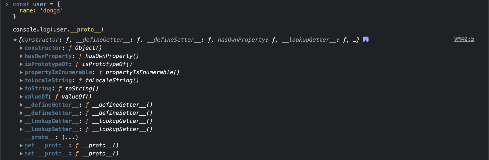

# 19장. 프로토타입

## 객체지향 프로그래밍

객체지향 프로그래밍은 프로그램을 명령어 또는 함수의 목록으로 보는 전통적인 명령형 프로그래밍의 절차지향적 관점에서 벗어나 여러 개의 독립전인 단위 즉 객체의 집합으로 프로그램을 표현하려는 프로그래밍 패러다임을 말한다.

객치지향 프로그래밍은 실세계의 실체(사물이나  개념)을 인식하는 철학적 사고를 프로그래밍에 접목하려는 시도에서 시작한다. 실체는 특징이나 성질을 나타내는 속성을 가지고 있고, 이를 통해 실체를 인식하거나 구별할 수 있다.

직원이 하는일은 개발이고, 이름,  사는지역, 인사표현을 해보겠다.

```javascript
const employee = {    
    name: 'DongHyun', // 이름
    work: 'Developement', // 하는 일
    address: 'Cheonan', // 사는지역
    greeting: `안녕하세요 저는 ${this.address}에 거주중인 ${this.name}입니다.`
}
```

위에서 name, work, addree는 상태를 나타내는 데이터이고 greeting은 동작이다.

위에처럼 <mark style="color:red;">**속성을 통해 여러 개의 값을 하나의 단위로 구성한 복합적인 자료구조를 객체**</mark>라 하고, <mark style="color:red;">**독립적인 객체의 집합으로 프로그램을 표현하려는 프로그래밍이 객체지향 프로그래밍(**</mark><mark style="color:purple;">Object oriented  Programming 줄여서OOP</mark><mark style="color:purple;"><mark style="color:red;">**)**<mark style="color:red;"></mark>이다.

객체지향 프로그래밍은 객체의 상태를 나타내는 데이터와 상태 데이터를 조작할 수 있는 동작을 하나의 논리적인 단위로 묶어 생각한다.&#x20;

* 객체의 <mark style="color:red;">**상태**</mark>를 나타내는 데이터를 <mark style="color:red;">**프로퍼티**</mark> 라고 부른다.
* 객체의 <mark style="color:red;">**동작을**</mark> 나타내는 데이터를 <mark style="color:red;">**메서드**</mark> 라고 부른다.

> 각 객체는 고유의 기능을 갖는 독립적인 부품으로 볼 수 있지만 자신의 고유한 기능을 수행하면서 다른 객체와 관계성을 가질 수 있다. 다른 객체와 메세지를 주고받거나 데이터를 처리할 수도 있다. 또는 다른 객체의 상태 데이터나 동작을 상속받아 사용하기도 한다.

## 상속과 프로토타입

상속은 객체지향 프로그래밍의 핵심 개념으로, 어떤 객체의 프로퍼티 또는 메서드를 다른 객체가 상속받아 그대로 사용할 수 있는 것을 말한다.

<mark style="color:red;">**자바스크립트는 프로토타입을 기반으로 상속을 구현하여 불필요한 중복을 제거한다. 중복을 제거하는 방법은 기존의 코드를 적극적으로 재사용하는 것이다.**</mark>

```javascript
function Employee(name, work, age, address){
    this.name = name;
    this.work = work;
    this.age = age;
    this.address = address;
    this.greeting = function(){
        return `안녕하세요 저는 ${this.address}에 거주중인 ${this.name}입니다.`
    }
}

const employee1 = new Employee('DongHyun', 'Developer', 28, '천안');
const employee2 = new Employee('WooJin', 'Designer', 31, '천안');
```

위 코드는 상태를 나타내는 데이터인 프로퍼티 구조는 같지만 프로퍼티 값은 다 다르다. 그렇지만 메서드를 보면 똑같은 코드로 들어가서 중복이 된다. 결국 하나의 메서드를 만들어놓고 그걸 사용하면 되는데, 지금은 생성자 함수로 만들었기 때문에 두개의 메서드를 만들고 있다.

위와 같은 문제는 같은 <mark style="color:red;">**메서드를 중복해서 사용하고 있기 때문에 메모리를 불필요하게 낭비**</mark>하게된다. 그리고 <mark style="color:red;">**인스턴스를 생성할 때마다 메서드를 생성하기 때문에 퍼포먼스에도 악역향**</mark>을 준다.

프로토타입을 기반으로 상속을 구현해보자.

```javascript
function Employee(name, work, age, address){
    this.name = name;
    this.work = work;
    this.age = age;
    this.address = address;
}

Employee.prototype.greeting = function(){
    return `안녕하세요 저는 ${this.address}에 거주중인 ${this.name}입니다.`
}

const employee1 = new Employee('DongHyun', 'Developer', 28, '천안');
const employee2 = new Employee('WooJin', 'Designer', 31, '천안');

console.log(employee1.greeting()) // 안녕하세요 저는 천안에 거주중인 DongHyun입니다.
console.log(employee2.greeting()) // 안녕하세요 저는 천안에 거주중인 WooJin입니다.
```

Employee 생성자 함수가 생성한 인스턴스들은 자신의 프로토타입 즉 상위(부모) 객체 역할을 하는 Employee prototype의 모든 프로퍼티와 메서드들을 상속받는다.

## 프로토타입 객체

프로토타입 객체는 객체지향 프로그래밍의 근간을 이루는 객체간 상속을 구현하기 위해 사용한다. <mark style="color:red;">**프로토타입은 어떤 객체의 상위(부모) 객체 역할을 하는 객체로서 다른 객체에 메서드와 프로퍼티를 공유할 수 있다.**</mark> <mark style="color:purple;">**프로토타입을 상속받은 하위(자식) 객체는 상위 객체의 프로퍼티를 자신의 프로퍼티처럼 자유롭게 사용 할 수 있다.**</mark>

### \_\_proto\_\_ 접근자 프로퍼티

모든 객체는 \_\_proto\_\_ 접근자 프로퍼티를 통해 자신의 프로토타입, 즉 \[\[ Prototype ]] 내부 슬롯에 간접적으로 접근할 수 있다.

<figure><figcaption></figcaption></figure>

\_\_proto\_\_ 프로퍼티는 접근자 프로퍼티이기 때문에 getter / setter 접근자 함수들로 구성되어 있다.&#x20;

```javascript
const user = {
  name: 'dongs'
}

// getter 함수에 접근
console.log(user.__proto__); // 프로토타입 취득 (값 접근)

// setter 함수로 값을 저장.
user.__proto__ = {
  name: 'DongHyun',
  age: 28,
};
```

\_\_proto\_\_ 접근자 프로퍼티는 객체가 직접 소유하는 프로퍼티가 아니라 Object.prototype의 프로퍼티다. 모든 객체는 상속을 통해서 Object.prototype.\_\_proto\_\_ 접근자 프로퍼티를 사용할 수 있다.

❗️프로토타입의 최상위 객체는 Object.prototype이다.

### \_\_proto\_\_ 접근자 프로퍼티를 통해 프로타입에 접근하는 이유

프로토타입에 접근하기 위해 접근자 프로퍼티를 사용하는 이유는 상호 참조에 의해 프로토타입 체인이 생성되는 것을 방지하기 위해서다. 프로토타입 체인은 단반향 링크드 리스트로 구현되어야한다. 즉 <mark style="color:red;">**프로퍼티 검색 방향이 한쪽 방향으로만 흘러가야 한다.**</mark> 하지만 <mark style="color:red;">**아래 예시는 서로가 자신의 프로토타입이 되기때문에 프로토타입 체인 종점이 존재하지 않아서 프로퍼티를 검색할 때 무한 루프에 빠지게된다.**</mark>

```javascript
const parent = {}
const child = {}

parent.__proto__ = child;
child.__proto__ = parent; // TypeError: Cyclic __proto__ value
```

### 함수 객체의 prototype 프로퍼티

함수 객체만이 소유하는 prototype 프로퍼티는 <mark style="color:red;">**생성자 함수가 생성할 인스턴스의 프로토타입을 가리킨다.**</mark> 따라서 non-constructor인 메서드 축약 표현과 화살표 함수는 prototype 프로퍼티를 가지지 않는다.

```javascript
function Employee (){}

// 함수 객체는 prototype 프로퍼티를 소유한다.
console.log(Employee.hasOwnProperty('prototype'))

// 일반 객체는 prototype 프로퍼티를 소유하지 않는다.
console.log(({}).hasOwnProperty('prototype'));

const arrow = () => {}

const obj = {
  fn(){},
  fn2: function (){}
}

console.log(arrow.hasOwnProperty('prototype')); // false
console.log(obj.fn.hasOwnProperty("prototype")); // false 
console.log(obj.fn2.hasOwnProperty("prototype")); // true
```

### 프로토타입의 constructor 프로퍼티와 생성자 함수

모든 프로토타입은 constructor 프로퍼티를 갖는다. <mark style="color:red;">**constructor 프로퍼티는 prototype 프로퍼티로 자신을 참조하고 있는 생성자 함수를 가리킨다.**</mark>

```javascript
function Employee (name){
  this.name = name;
}
const employee1 = new Employee('Dongs');

console.log(employee1.constructor === Employee); // true
```

employee1 객체에는 constructor 프로퍼티가 없지만 employee1 객체의 프로토타입인 Employee.prototype의 constructor 프로퍼티를 상속받아 사용할 수 있다.

### 리터럴 표기법에 의해 생성된 객체의 생성자 함수와 프로토타입

리터럴 표기법에 의해 생성된 객체도 상속을 위해 프로토타입이 필요하다. 따라서 <mark style="color:red;">**리터럴 표기법에 의해 생성된 객체도 가상적인 생성자 함수를 갖는다.**</mark> 프로토타입은 생성자 함수와 더불어 생성되며 prototype. constructor 프로퍼티에 의해 연결되어 있기 때문이다. <mark style="color:red;">**프로토타입과 생성자 함수는 단독으로 존재할 수 없고 언제나 쌍으로 존재한다**</mark>

```javascript
const obj = {}
console.log(obj.constructor === Object); // true

const arr = []
console.log(arr.constructor === Array) // true

function foo(){}
console.log(foo.constructor === Function) // true
```

## 프로토타입 생성 시점

객체는 리터럴 표기법 또는 생성자 함수에 의해 생성되므로 결국 모든 객체는 생성자 함수와 연결되어 있다.

<mark style="color:red;">**프로토타입은 생성자 함수가 생성되는 시점에 더불어 생성된다.**</mark> 프로토타입과 생성자 함수는 단독으로 존재할 수 없고 쌍으로 존재하기 때문이다.

### 사용자 정의 생성자 함수와 프로토타입 생성 시점

<mark style="color:red;">**constructor인 함수 정의가 평가되어 함수 객체를 생성하는 시점에 프로토타입이 생성된다.**</mark> non-constructor인 메서드 축약표현과 화살표 함수는 프로토타입이 생성되지 않는다.

```javascript
// 함수가 평가되어 함수 객체를 생성하는 시점에 프로토타입도 생성된다.
console.log(Employee.prototype);
function Employee (){} // constructor 함수

const employee = () => {}
console.log(employee.prototype);
```

생성된 프로토타입은 오직 constructor 프로퍼티만을 갖는 객체다. <mark style="color:red;">**프로토타입도 객체이고 모든 객체는 프로토타입을 가지므로 프로토타입도 자신의 프로토타입을 갖는다.**</mark> 생성된 프로토타입의 프로토타입은 Object.prototype이다.

### 빌트인 생성자 함수와 프로토타입 생성 시점

빌트인 생성자 함수가 생성되는 시점에 프로토타입이 생긴다. <mark style="color:red;">**모든 빌트인 생성자 함수는 전역 객체가 생성되는 시점에 생성된다.**</mark> 클라이언트 사이드 환경에서는 window객체, 서버 사이드 환경에서는 global 객체다.

```javascript
console.log(window.Object === Object) // true
```

## 객체 생성 방식과 프로토타입의 결정

객체 생성 방법&#x20;

* 객체 리터럴 {}
* Object 생성자 함수
* 생성자 함수
* Object.create 메서드
* 클래스

다양한 방식으로 생성할 수 있지만 <mark style="color:red;">**추상 연산 OrdinaryObjectCreate에 의해 생성된다는 공통점**</mark>이 있다. 추상 연산 OrdinaryObjectCreate는 빈 객체를 생성한 후 객체에 추가할 프로퍼티 목록이 인수로 전달된 경우 프로퍼티를 객체에 추가한다. 그리고 인수로 전달받은 프로토타입을 자신이 생성한 객체의 \[\[ Prototype ]] 내부 슬롯에 할당한 다음 객체를 반환한다.

<mark style="color:red;">**프로토타입은 추상 연산 OrdinaryObjectCreate에 전달되는 인수에 의해 결정된다.**</mark>

### 객체 리터럴에 의해 생성된 객체의 프로토타입

자바스크립트 엔진은 객체 리터럴을 평가하고 객체를 생성할 때 추상 연산을 호출한다. 이때 OrdinaryObjectCreate에 전달되는 프로토타입은 Object.prototype이다.

```javascript
const user = {
  name: 'dongs'
}

// user는 constructor 프로퍼티와 hasOwnProperty를 자신의 자산인 것처럼 자유롭게 사용할 수 있다.
console.log(user.constructor === Object); // true
```

### 생성자 함수에 의해 생성된 객체의 프로토타입

new 연산자와 함께 생성자 함수를 호출하여 인스턴스를 생성하면 위에 객체 생성 방식과 마찬가지로 추상 연산 OrdinaryObjectCreate가 호출된다. 이때 추상 연산 OrdinaryObjectCreate에 전달되는 프로토타입은 생성자 함수의 prototype 프로퍼티에 바인딩 되어 있는 객체다.

<mark style="color:red;">**즉 생성자 함수에 의해 생성되는 객체의 프로토타입은 생성자 함수의 prototype 프로퍼티에 바인딩 되어 있는 객체다.**</mark>

## <mark style="color:red;">프로토타입 체인</mark>

프로토타입 체인이란 자바스크립트가 <mark style="color:red;">**객체의 프로퍼티에 접근하려고 할 때 해당 객체에 접근하려는 프로퍼티가 없다면 \[\[ Prototype ]] 내부 슬롯의 참조를 따라 자신의 부모 역할을 하는 프로토타입의 프로퍼티를 순차적으로 검색**</mark>하는것을 말한다.

❗️프로토타입의 프로토 타입은 언제나 Object.prototype이다.

❗️ 프로토타입 체인은 자바스크립트가 객체지향 프로그래밍의 상속을 구현하는 메커니즘이다.


<mark style="color:red;">****</mark>
