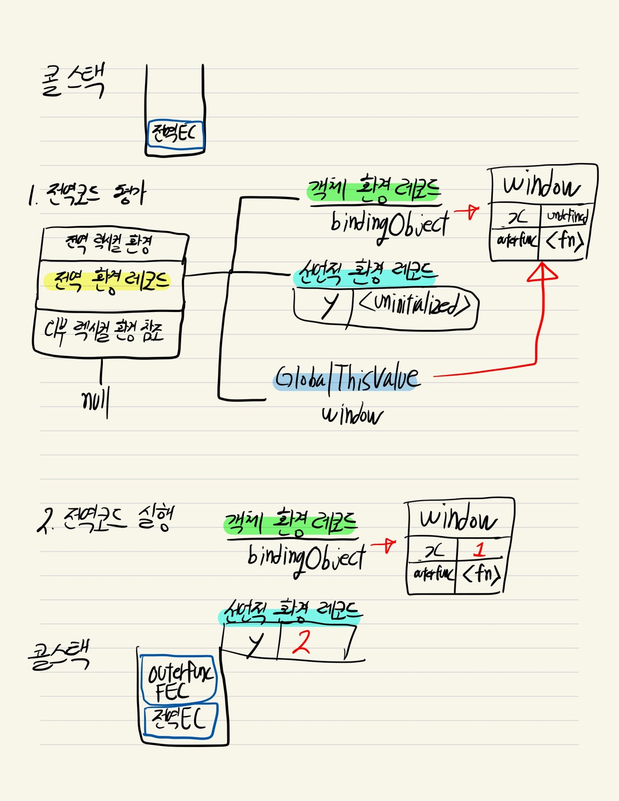
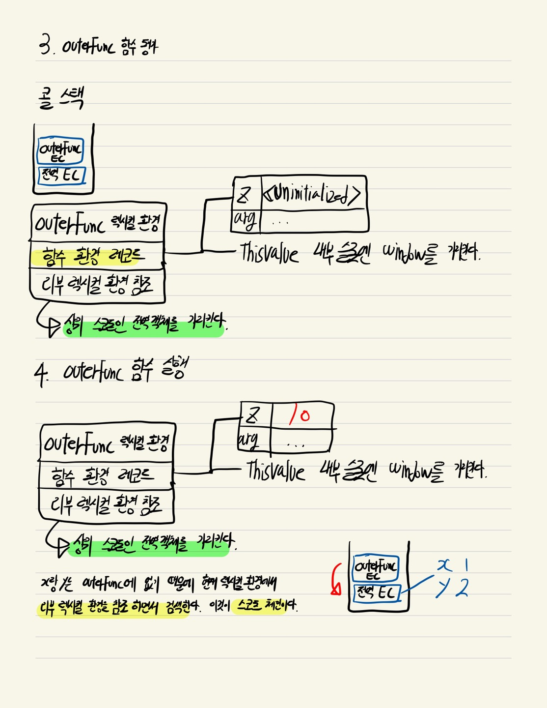
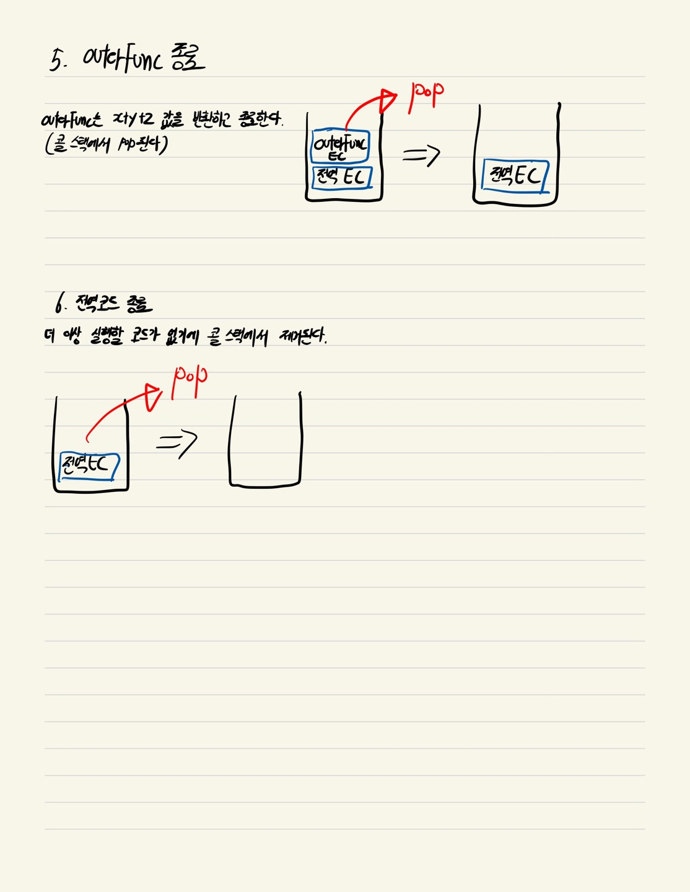

# 23장. 실행 컨텍스트

## 실행 컨텍스트란(Execution Context) ?

실행 컨텍스트는 소스코드를 실행하는 데 필요한 환경을 제공하고 코드의 실행 결과를 실제로 관리하는 영역이다. 조금 더 구체적으로 <mark style="color:red;">**식별자(변수, 함수, 클래스를 등록하고 관리하는 스코프와 코드 실행 순서 관리를 구현한 내부 메커니즘**</mark>으로, 모든 코드는 실행 컨텍스트를 통해 실행되고 관리된다.

## 소스코드의 타입

* 전역 코드: 전역에 존재하는 소스코드를 말한다.
* 함수 코드: 함수 내부에 존재하는 소스코드를 말한다.
* eval 코드: 빌트인 전역 함수인 eval 함수에 인수로 전달되어 실행되는 소스코드를 말한다.
* 모듈 코드: 모듈 내부에 존재하는 소스코드를 말한다.

## 소스코드 평가와 실행

자바스크립트 엔진은 2개의 과정을 나누어 처리한다.

### 소스코드 평가

소스코드 평가 과정에서는 실행 컨텍스트를 생성하고 변수, 함수등의 선언문만 먼저 실행하여 실행 컨텍스트가 관리하는 스코프에 등록한다.

### 소스코드 실행

소스코드 평가 과정이 끝나면 선언문을 제외한 코드들이 순차적으로 실행된다. (런타임이 시작된다.) 이 때 변수나 함수의 참조를 실행 컨텍스트가 관리하는 스코프에서 검색해서 취득한다.

## 실행 컨텍스트 스택 (Call stack)

실행 컨텍스트는 스택 자료구조로 관리되는데 이것을 <mark style="color:red;">**실행 컨텍스트 스택(Call stack)**</mark>이라고 부른다.  실행 컨텍스트 스택은 실행 순서를 나타낸다.

콜 스택 확인해보는 사이트: [http://latentflip.com/](http://latentflip.com/)

```javascript
const x = 5

function outerFunc(){
  function innerFunc(){}
  innerFunc();
}
outerFunc();
```

자바스크립트 엔진은 먼저 전역 코드를 평가하고 <mark style="color:red;">**전역 실행 컨텍스트**</mark>를 생성한다. 그 다음 함수가 호출되면 함수 코드를 평가하고 <mark style="color:red;">**함수 실행 컨텍스트**</mark>를 생성한다.

❗️실행 컨텍스트 스택은 첫번째로 들어온것이 맨 마지막에 제거된다. 또는 맨 마지막에 들어온것이 먼저 제거된다.

### 컨텍스트의 스택 순서

1. 전역 코드 실행: \[ 전역 EC ]
2. outerFunc 함수 실행 \[ 전역 EC, outerFunc EC ]
3. innerFunc 함수 실행 \[ 전역 EC, outerFunc EC, innerFunc EC ]
4. innerFunc 함수 종료 \[ 전역 EC, outerFunc EC ]
5. outerFunc 함수 종료 \[ 전역 EC ]
6. 전역 코드 종료: \[ ]

<figure><figcaption></figcaption></figure>

## <mark style="color:red;">전역 실행 컨텍스트 (Global Execution Context)</mark>

자바스크립트 엔진은 전역 코드를 평가하고 전역 실행 컨텍스트를 실행 컨텍스트 스택에 등록한다.

## <mark style="color:red;">함수 실행 컨텍스트 (Function Execution Context)</mark>

자바스크립트 엔진은 함수가 호출되면 전역 코드를 중지하고, 해당 함수 내부로 들어가 코드를 평가한다. 함수가 호출될 때 함수 실행 컨텍스트를 스택에 등록한다.

## <mark style="color:red;">렉시컬 환경(Lexical Environment)</mark>

렉시컬 환경은 식별자와 식별자에 바인딩된 값, 그리고 상위 스코프에 대한 참조를 기록하는 자료구조로 실행 컨텍스트를 구성하는 컴포넌트다. 즉 <mark style="color:red;">**스코프와 식별자를 관리한다.**</mark>

### 환경 레코드(Environment Record)

스코프에 포함된 식별자를 등록하고 등록된 식별자에 바인딩된 값을 관리하는 저장소다.

* <mark style="color:red;">**객체 환경 레코드(Object Environment Record)**</mark>: var 키워드로 선언한 전역 변수와 함수 선언문으로 정의한 전역 함수, 빌트인 전역 프로퍼티와 빌트인 전역 함수, 표준 빌트인 객체를 관리한다
* <mark style="color:red;">**선언적 환경 레코드(Declarative Environment Record)**</mark>: let, const 키워드로 선언한 전역 변수를 관리한다.

### 외부 렉시컬 환경에 대한 참조(Outer Lexical Environment Reference)

외부 렉시컬 환경에 대한 참조는 상위 스코프를 가리킨다. 즉 해당 실행 컨텍스트를 생성한 소스코드를 포함하는 <mark style="color:red;">**상위 코드의 렉시컬 환경**</mark>을 말한다.

## 환경 레코드(environment Record)와 호이스팅(Hoisting)

자바스크립트는 코드를 실행하기전에 (코드를  평가할 때) 식별자를 등록한다. <mark style="color:red;">**식별자를 미리 환경 레코드에 등록하기 때문에 호이스팅이라는 개념이 생긴것이다. 함수 선언문으로 정의한 함수가 평가되면 함수 이름과 동일한 이름의 식별자를 객체 환경 레코드에 바인딩된 BindingObject를 통해 전역 객체에 키로 등록**</mark>하고 생성된 함수 객체를 즉시 할당한다.&#x20;

let, const 키워드로 선언한 변수도 변수 호이스팅이 발생한다. 하지만 let, const 변수는 선언 단계와 초기화 단계가 분리되어 있기 때문에 실행  과정이 아닌 평가과정에서는 참조 할 수 없다. (선언적  환경  레코드에 Uninitialized로 되어있다.)


## 외부 렉시컬 환경에 대한 참조와스코프 체인

식별자를 참조하고 있는 렉시컬 환경에서 식별자를 찾아보고, 없으면 외부 렉시컬 환경을 참조하면서 검색하게된다. 이때 중첩이 되어있는 함수일 경우에 외부 렉시컬 환경을 연속적으로 참조하면서 검색해 나간다. 이것이 스코프 체인의 원리다.

❗️ 조금 더 구체적으로는 렉시컬 환경에 환경 레코드(객체 환경또는 선언전 환경)에서 검색한다.

## 실행 컨텍스트와 블록 레벨 스코프

자바스크립트 엔진은 블록문을 만나면 <mark style="color:red;">**선언적 환경 레코드를 갖는 렉시컬 환경을 새롭게 생성하고, 기존에 전역 렉시컬 환경을 교체한다.**</mark> 이 때 새롭게 생성된 블록문의 코드 블록을 위한 렉시컬 환경에 외부 렉시컬 환경에 대한 참조는 이전 렉시컬 환경을 가리킨다.

## 그림 예제

```javascript
var x = 1;
const y = 2

function outerFunc(){
    const z = 10;
    return x + y + z;
};
outerFunc();
```

<figure><figcaption></figcaption></figure>

<figure><figcaption></figcaption></figure>

<figure><figcaption></figcaption></figure>


