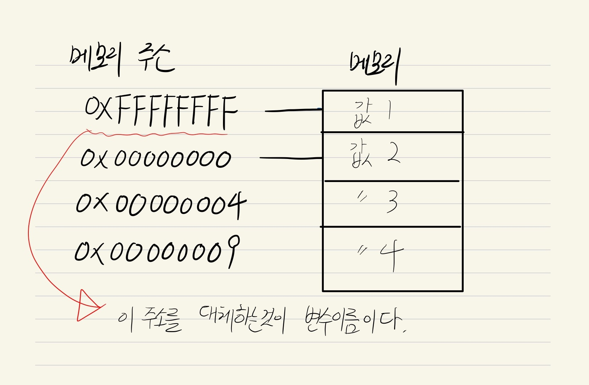

# 4장. 변수

## 변수란 ? <a href="#undefined" id="undefined"></a>

변수는 하나의 값을 저장하기 위해 확보한 메모리공간을 식별하기위해 붙인 이름을 말한다. 자세하게 풀어서 설명하자면 하나의 값을 저장하기 위해 확보한 메모리공간에, 메모리 주소가 있는데, 이 메모리 주소는 2진수로 되어있어 사람이 쉽게 알아볼수가없다. 그래서 <mark style="color:red;">**변수이름으로 메모리 주소를 참조**</mark>하게 되고, 메모리주소를 참조하게 된다는건 해당되는 메모리에 값을 가져올 수 있다.

<figure><figcaption></figcaption></figure>

## 식별자란 ? <a href="#undefined" id="undefined"></a>

식별자는 앞으로 배울 함수, 클래스, 변수 등등 어떤값을 식별할 수 있는 고유의 이름을 말한다.\
식별자는 메모리 주소를 기억하고 있다.


## 변수선언 ES5 <a href="#es5" id="es5"></a>

var 라는 키워드를 사용해서 변수를 선언할 수 있다.\
변수를 선언만하게 될 경우 자바스크립트는 undefined 값을 넣게된다.

* 선언단계: 우리가 선언한 모든 식별자들을 자바스크립트 엔진에 알린다.
* 초기화단계: 값을 저장하기 위한 메모리공간을 확보하고 undefined로 할당해 초기화한다.

```javascript
var name; // 초기화단계로 인한 undefined
```


## 변수선언 및 할당 / 재할당 <a href="#undefined" id="undefined"></a>

변수에 값을 할당할때에는 할당연산자 = 를 사용한다.\
오른쪽에 있는값을 왼쪽에 값을 넣는다 라고 생각하면된다.

```javascript
var name;
name = "dongs"; // 값을 할당만 한것.

// 위에 코드를 한줄로 쓰면
var name2 = "dongs"; // 변수선언과 동시에 할당까지 가능하다.

name2 = "dongPro"; // 변수는 값이 변할 수 있기때문에 재할당이 가능하다.
```

```javascript
// var 띄어쓰기하고 변수이름을 적으면 변수를 선언한다는 뜻이다.
var 변수이름
```

## 변수선언 및 할당 <a href="#undefined" id="undefined"></a>

할당은 오른쪽에 있는 값을 왼쪽에 넣는다라고 생각하면 좋다.


```javascript
// 아직 데이터타입에 대해 배우지 않았지만 오른쪽에 있는값을 왼쪽에다 넣는다.
var 변수이름 = 5;

console.log(변수이름); // console.log()는 자바스크립트 데이터를 확인하거나 에러확인할 때 사용한다.
```


## 변수 재할당 <a href="#undefined" id="undefined"></a>

변수는 값이 변할 수 있기때문에 값을 재할당을 통해서 바꿀 수 있다.

```javascript
var 변수이름 = 5;
console.log(변수이름); // 5

// 한번 선언을 했으니 재할당으로 값을 바꿀 수 있다.

변수이름 = 10;
console.log(변수이름); // 10
```

## 변수 호이스팅이란 ? <a href="#undefined" id="undefined"></a>

자신을 참조하고있는 스코프에서 변수선언부분을 위로 끌어올린것처럼 결과가 나오는것이 호이스팅이다.

### 식별자 네이밍 규칙. <a href="#undefined" id="undefined"></a>

* 예약어 금지 (프로그래밍에서 사용하는 언어 또는 사용될 언어)
* 특수문자를 제외한 문자, 숫자, 언더바(\_), $기호를 사용할 수 있다. 단 숫자가 먼저와서는 안된다.
* <mark style="color:red;">**변수이름을 지을때에는 항상 의미있는 이름을 지어야한다.**</mark>
* 변수이름은 낙타 등처럼 생겼다해서 Camel Case를 많이사용한다.

```javascript
// Camel Case 첫번째단어를 제외한 두번째단어 시작하는 알파벳에 대문자를 넣는다.
var getNumber = 10;
var followListHandler = getFollowListRequest();

// Pascal Case 생성자함수, 클래스에서는 파스칼케이스로 사용한다.
class Canvas(){}
```
